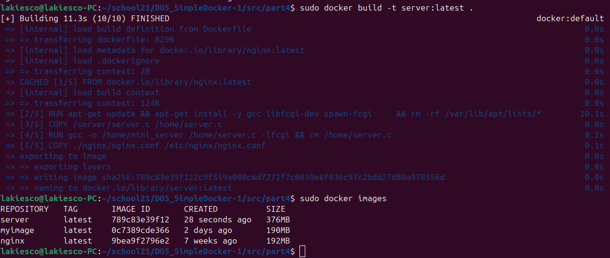

## PART 1

- **Берем официальный Docker образ nginx с DockerHub**

- **Проверяем наличие докер образа**

    

- **Создаем котейнер на основе Docker образа nginx. Контейнер работает в фоновом режиме за счет флага -d.**

- **Проверяем наличие запущенного контейнера nginx.**

    

- **Получаем подробную информацию о контейнере в JSON формате. С помощью флага -s получаем размер контейнера.**

    

    **Исходя из JSON вывода команды docker inspect мы получаем:**
1. Размер контейнера(SizeRootFs) + размер файловой системы контейнера(SizeRw). Информация предоставляется в байтах:

    

2. Замапленные порты:
    
    

3. IP контейнера:

    

- **Останавливем nginx контейнер** 
  
    

- **Проверяем, что контейнер остановлен**

    

- **Создаем контейнер с замапленными портами 80 и 443**

  

- **Проверяем замапленный 80 порт с помощью localhost:80**

  

- **Перезапускаем контейнер**
  
    

- **Проверяем, что контейнер перезапустился**

  

## PART 2

- **Читаем конфиг файл nginx и создаем его на хост машине**

  

- **Настраиваем nginx.conf для отдачи страницы статуса nginx, загружаем новый конфиг через docker cp и перезагружаем nginx**

  

- **Проверяем, что по адресу localhost:80/status отдается страница статуса**

1. localhost:80/status

    

- **Экспортируем файловую систему контейнера в container.tar**

    

- **Останавливаем контейнер**

  

- **Удаляем образ не удаляя контейнеры**

  

- **Импортируем экспортированный образ (container.tar)**

  

- **Создаем контейнер на основе нашего образа**

  

- **Проверяем, что после запуска контейнера страница localhost:80/status работает**

1. localhost:80/status

   

## PART 3

- **Пишем простенький fcgi сервер, который будет отдавать Hello World на каждый звпрос от веб сервера.** 
  
     

- **Запускаем наше приложение через spawn-fcgi и устанавливаем порт 8080**
  - spawn-fcgi -p 8080 -n fcgi
  
    

- **Добавялем директиву server и location в конфиг nginx. Директива server будет слушать 81 порт и проксировать запросы на порт 8080.**

  

- **Заходим в браузер и подключаемся по localhost:81**

  

## PART 4

- **Пишем докерфайл**

  

- **Собираем докер образ с помощью docker build. Указываем имя и тег(версию) образа**

  

- **Запускаем docker образ с замапленными портами 80 на 81 контейнера и маппим наш nginx конфиг**

  

- **Провряем что на localhost:80 доступна написанная нами страница**

  

- **Добавляем в nginx.conf страницу статуса nginx**

  

- **Проверяем, что по адресу localhost:80/status отдается страница статуса**

  

## PART 5

- **Проверяем с помощью утилиты dockle безопасность нашего docker образа**

  
  - CIS-DI-0001: Create a user for the container
Лучше не запускать контейнер от имени пользователя root. Для этого можно создать нового пользователя и запускать контейнер от его имени. 
  - CIS-DI-0005: Enable Content trust for Docker
Это информационное сообщение, которое напоминает о том, что можно включить Content Trust для Docker, чтобы убедиться, что образы, которые вы загружаете или строите, подписаны. Это делается с помощью переменной окружения DOCKER_CONTENT_TRUST=1
- **Проверяем после всех исправлений**
    

## PART 6

- **Поднимаем первый контейнер без маппинга портов**

  
  
- Поднимаем чистый nginx сервер с маппингои 80 на 8080, а внутри проксируем все на 81.

  
  - Dockerfile
  
    

  - nginx.conf
  
    
  
  - IP первого контейнера
  
    
  
  - Проверяем, что все работает
  
    

- **Останавливаем все контейнеры**

  

- **Собираем и запускаем проект с помощью docker-compose build и docker-compose up**
  
  - Docker-compose файл
  
    

- **Проверяем, что все работает**

  